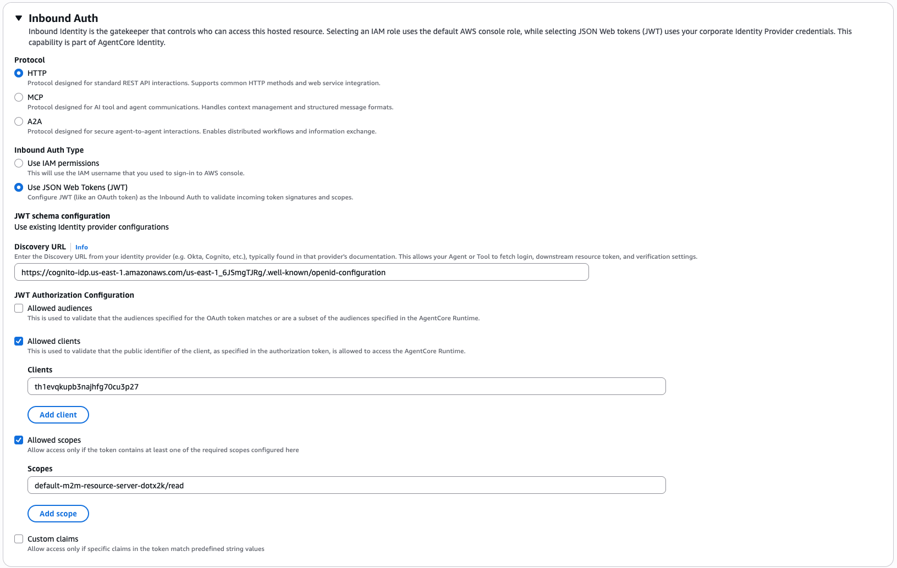

# Configure AWS Resources

This guide walks you through setting up all the AWS resources needed to deploy and run the AgentCore web automation agent.

## Prerequisites

- AWS Account
- AWS Management Console access
- AWS CLI installed and configured

---

## Step 1: Create IAM User with Admin Access

### Why?

You need an IAM user with appropriate permissions to create and manage AWS resources.

### Steps:

1. **Go to IAM Console**

   - Open AWS Management Console
   - Search for "IAM" and click on it
   - Navigate to "Users" in the left sidebar

2. **Create New User**

   - Click "Create user"
   - Enter username: `agentcore-admin`
   - Click "Next"

3. **Set Permissions**

   - Click "Attach policies directly"
   - Search for "AdministratorAccess"
   - Check the box next to "AdministratorAccess"
   - Click "Next" → "Create user"

4. **Create Access Keys**

   - Click on the newly created user
   - Go to "Security credentials" tab
   - Click "Create access key"
   - Choose "Command Line Interface (CLI)"
   - Click "Create access key"
   - **Save the Access Key ID and Secret Access Key** (you'll need these)

5. **Configure AWS CLI**
   ```bash
   aws configure
   ```
   - Enter Access Key ID from step 4
   - Enter Secret Access Key from step 4
   - Region: `us-east-1`
   - Output format: `json`

---

## Step 2: Create S3 Bucket for File Storage

### Why?

S3 bucket stores files downloaded by the automation agent.

### Steps:

1. **Go to S3 Console**

   - Search for "S3" in AWS Management Console
   - Click on "S3"

2. **Create Bucket**

   - Click "Create bucket"
   - Bucket name: `agentcore-automation-storage` (create a custome bucket name since it must be globally unique)
   - Region: `us-east-1`
   - Leave other settings as default
   - Click "Create bucket"

3. **Save Bucket Name**
   - Note down your bucket name for later use
   - You'll need this in the `.bedrock_agentcore.yaml` file (you will see this file after you execute the deployment code in [agetn_deployment notebook](/agents/agent_deployment.ipynb))

---

## Step 3: Create Amazon Cognito User Pool

### Why?

Cognito provides authentication and authorization for invoking your agent securely.

### Steps:

1. **Go to Cognito Console**

   - Search for "Cognito" in AWS Management Console
   - Click "Create user pool"

2. **Name User Pool**

   - Under Name your application, set User pool name: `agentcore-user-pool`
   - Click "Next"

3. **Keep Default Settings**

   - Continue clicking "Next" through all remaining steps
   - Click "Create user pool"

4. **Save User Pool ID**
   - User pool ID will be displayed (e.g., `us-east-1_6JSmgTJRg`)
   - **Note this down - you'll need it**

### Create App Client (Machine-to-Machine)

1. **Go to App Integration → App clients and analytics**

   - Click "Create app client"
   - Application type: Select **"Machine to Machine"**
   - App client name: `agentcore-app-client`
   - Click "Next"
   - Click "Create app client"

2. **Save Client Credentials**
   - Click on your newly created app client
   - Copy and save:
     - **Client ID** (e.g., `th1evqkupb3najhfg70cu3p27`)
     - **Client Secret** (click "Show Details")

### Create Cognito Domain

1. **Go to App Integration → Domain name**

   - Click "Create Cognito domain"
   - Domain prefix: `agentcore-<your-name>` (must be unique)
   - Click "Create Cognito domain"

2. **Save Cognito Token URL**
   - Your Cognito Token URL is:
     ```
     https://agentcore-<your-name>.auth.us-east-1.amazoncognito.com/oauth2/token
     ```

### Get OAuth2 Access Token

To invoke your agent, you'll use your Client ID, Client Secret, and Cognito Token URL to get an access token:

```python
import requests

# Your Cognito credentials (from previous steps)
COGNITO_TOKEN_URL = "https://<your-cognito-user-pool-id>.auth.us-east-1.amazoncognito.com/oauth2/token"
CLIENT_ID = "your-app-client-id"  # Replace with your Client ID
CLIENT_SECRET = "your-app-client-secret"  # Replace with your Client Secret
SCOPE = "default-m2m-resource-server-dotx2k/read"

Use this `access_token` to invoke your agent in the `invoke_agent.ipynb` notebook.

---

## Step 4: Create AWS Systems Manager Parameter Store for API Keys

### Why?
Securely store sensitive credentials (like Nova Act API key) that your agent needs.

### Steps:

1. **Go to Systems Manager Console**
   - Search for "Systems Manager"
   - Click on "Parameter Store" in left sidebar

2. **Create Parameter**
   - Click "Create parameter"
   - Name: `/agentcore/nova-act-api-key`
   - Type: "Secure String"
   - Value: `<your-nova-act-api-key>` or use this one: 50d5f914-8f10-4a14-be4c-2f51f31af940
   - Click "Create parameter"

3. **Save Parameter Name**
   - Note the parameter name: `/agentcore/nova-act-api-key`
   - Your agent will use this to fetch the API key

---

## Step 5: Create IAM Role for AgentCore Execution

### Why?
AgentCore runtime needs permissions to access S3, Parameter Store, and other AWS services.

### Steps:

1. **Go to IAM Console → Roles**
   - Click "Create role"
   - Trusted entity type: "AWS service"
   - Service: "AWS Bedrock Agentcore"
   - Click "Next"

2. **Add Permissions**
   - Search and attach:
     - `AmazonBedrockFullAccess` (or scoped policy)
     - `AmazonS3FullAccess` (or scoped to your bucket)
     - `AmazonSSMReadOnlyAccess` (for Parameter Store)
     - `AmazonEC2ContainerRegistryReadOnly` (for ECR access)
   - Click "Next"

3. **Name Role**
   - Role name: `AmazonBedrockAgentCoreSDKRuntime-us-east-1`
   - Click "Create role"

4. **Save Role ARN**
   - Click on your newly created role
   - Copy the ARN (e.g., `arn:aws:iam::254599367545:role/AmazonBedrockAgentCoreSDKRuntime-us-east-1`)
   - **You'll need this in `.agent_deployment.ipynb`**

---

## Step 6: Create ECR Repository for Docker Images

### Why?
ECR stores the Docker container image of your agent.

### Steps:

1. **Go to ECR Console**
   - Search for "ECR" in AWS Management Console
   - Click "Repositories" in left sidebar

2. **Create Repository**
   - Click "Create repository"
   - Repository name: `bedrock-agentcore-nabo-agent`
   - Click "Create repository"

3. **Save Repository URI**
   - Copy the repository URI and remove tags
   - Format: `<ACCOUNT_ID>.dkr.ecr.us-east-1.amazonaws.com/bedrock-agentcore-nabo-agent`
   - **You'll need this in `.agent_deployment.ipynb`**

---

## Step 7: Gather Information for Configuration

Create a file or note with all the information below (you'll need it):

```

AWS Account ID: 254599367545

IAM User:

- Access Key ID: [YOUR_ACCESS_KEY]
- Secret Access Key: [YOUR_SECRET_KEY]

S3 Bucket:

- Bucket Name: agentcore-automation-storage

Cognito:

- User Pool ID: us-east-1_6JSmgTJRg
- User Pool ARN: arn:aws:cognito-idp:us-east-1:254599367545:userpool/us-east-1_6JSmgTJRg
- App Client ID: th1evqkupb3najhfg70cu3p27
- App Client Secret: [YOUR_CLIENT_SECRET]
- Cognito Token URL: https://<your-user-pool-id>.auth.us-east-1.amazoncognito.com/oauth2/token

Parameter Store:

- Parameter Name: /agentcore/nova-act-api-key

IAM Role for AgentCore:

- Role Name: AmazonBedrockAgentCoreSDKRuntime-us-east-1
- Role ARN: arn:aws:iam::254599367545:role/AmazonBedrockAgentCoreSDKRuntime-us-east-1

ECR Repository:

- Repository Name: bedrock-agentcore-nabo-agent
- Repository URI: 254599367545.dkr.ecr.us-east-1.amazonaws.com/bedrock-agentcore-nabo-agent

````

---

## Step 8: Update Configuration Files

Once you have all the information above:

1. **Update `agent_deployment.ipynb`**
   - Set `s3_bucket` to your S3 bucket name
   - Set `execution_role` to your role ARN
   - Set `ecr_repository` to your ECR URI

2. **Update `invoke_agent.ipynb`**
   - Set `CLIENT_ID` to your Cognito App Client ID
   - Set `CLIENT_SECRET` to your Cognito App Client Secret
   - Set `COGNITO_TOKEN_URL` with your User Pool ID

---

## Step 9: Update AgentCore Runtime Inbound Auth Settings

### Why?
You need to configure the inbound authentication settings so that your Cognito credentials can be used to invoke the agent securely.

### Steps:

1. **Navigate to AWS Bedrock AgentCore Runtime**
   - Go to AWS Management Console
   - Search for "Bedrock"
   - Click on " AWS Bedrock AgentCore" service
   - In the left sidebar, look for "runtime"
   - Find the agent run time "nabo_group_web_automation_agent"
   - Click on your agent runtime to open details

2. **Update Inbound Auth Settings**
   - In the runtime details page, clicked "Update Hosting" on the top right corner
   - Configure the following:
     - **Protocol**: Select `HTTP` (already selected)
     - **Inbound Auth Type**: Select `Use JSON Web Tokens (JWT)`
     - **JWT schema configuration**: Select "Use existing identity provider configurations"
     - **Discovery URL**: Enter your Cognito Discovery URL:
       ```
       https://cognito-idp.us-east-1.amazonaws.com/<YOUR_USER_POOL_ID>/.well-known/openid-configuration
       ```
       Replace `<YOUR_USER_POOL_ID>` with your actual User Pool ID (e.g., `us-east-1_6JSmgTJRg`)
     - **JWT Authorization Configuration**:
       - Check "Allowed clients"
       - In the "Clients" field, enter your Cognito App Client ID (e.g., `th1evqkupb3najhfg70cu3p27`)
       - Check "Allowed scopes"
       - In the "Scopes" field, enter: `default-m2m-resource-server-dotx2k/read`
     - Click "Save"

3. **Verify Configuration**
   - Refer to the screenshot below for visual guidance on how to configure these settings:



````
